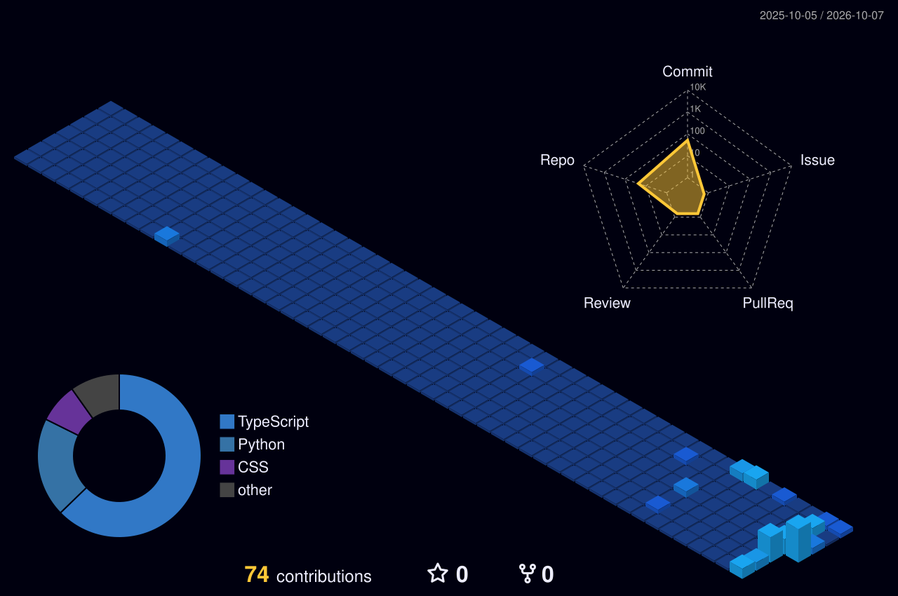

  <!-- THEME AUTO-SWITCHING ANIMATED BANNER (Dark / Light Mode) -->
  <picture>
    <source media="(prefers-color-scheme: dark)" srcset="banner.svg?v=1">
    <source media="(prefers-color-scheme: light)" srcset="banner-light.svg?v=1">
    
  </picture>

# Revanth Yarramsetti

**B.Tech Computer Science (2024) · Hyderabad, India**

I build AI agent systems, evaluation harnesses, and guardrail pipelines — mostly in
Python and TypeScript. My focus is making LLM-backed software *verifiable*: deterministic
scoring instead of vibes, offline testable, with CI gates that actually fail when quality
regresses.

**Currently open to Software Engineer roles (fresher / entry-level), anywhere in India.**

### What I work with

| Area | Stack |
|:---|:---|
| **Backend** | Python, FastAPI, Flask, Node.js, Express, REST APIs |
| **Frontend** | TypeScript, React, Vite, Tailwind |
| **Data & AI** | Prisma, PostgreSQL, pgvector, hybrid vector search, RAG |
| **AI systems** | Agent orchestration, LLM evaluation harnesses, prompt-injection guardrails, MCP |
| **Testing** | pytest, Vitest, GitHub Actions |
| **Cloud** | AWS, Azure, Docker |

### Things I've built

- **ForgePilot** — local-first, evaluation-driven agentic software engineer with
  planner / coder / tester / security agents over a real stdio MCP server.
- **EvalForge** — deterministic LLM evaluation and safety-guardrail platform with
  lexical proxy metrics and offline CI gates.
- **Enterprise AI SupportOps Copilot** — bounded agent orchestration with hybrid RAG,
  guardrails, Prometheus metrics, and a benchmark suite.
- **PromptShield** — deterministic LLM security gateway: prompt-injection, secret and
  PII scanning with explainable policy decisions.
- **AI Career Intelligence Platform** — full-stack resume/job matching with hybrid
  vector search, explainable matching, and tool-calling agents.
- **AI Data Quality** and **AI Inference Gateway** — dataset profiling with anomaly
  detection, and a deterministic-routing gateway with graceful fallback.

### Let's connect

Open to **Software Engineer** roles (fresher / entry-level), anywhere in India.

| | |
|:---|:---|
| **LinkedIn** | [linkedin.com/in/revanthyarramsett1627i](https://www.linkedin.com/in/revanthyarramsett1627i) |
| **Email** | princerevanth369@gmail.com |
| **GitHub** | [github.com/Revanth2716](https://github.com/Revanth2716) |

 

---

  <!-- QUICK NAVIGATION BADGES -->
  
  
  
  
  

    

  <!-- ABOUT & LIFE PANEL -->
  
  

    

  <!-- ATOMIC TECH STACK & ORBITS -->
  
  

    

  <!-- ID BADGE & REAL-TIME DASHBOARD -->
  
  

    

  <!-- STANDALONE LOCAL METRICS & STAT CARDS (Zero 3rd-Party Fragility) -->
  <table border="0" width="100%" cellspacing="0" cellpadding="0">
    <tr align="center">
      <td width="50%" align="center" style="padding-right: 10px;">
        
      </td>
      <td width="50%" align="center" style="padding-left: 10px;">
        
      </td>
    </tr>
  </table>

   

  <!-- CUSTOM PORTFOLIO HIGHLIGHTS & ENGINEERING MILESTONES -->
  

 

---

### 🚀 Flagship Projects (2025 – 2026)

Verified autonomous systems, guardrail platforms, and cloud infrastructure engineered for production reliability:

<table>
  <thead>
    <tr>
      <th width="28%">Repository &amp; System</th>
      <th width="44%">Architecture &amp; Core Highlights</th>
      <th width="14%">Primary Stack</th>
      <th width="14%">Live Status</th>
    </tr>
  </thead>
  <tbody>
    <tr>
      <td>
        <a href="https://github.com/Revanth2716/forgepilot"><b>⚡ ForgePilot</b></a> 
        Free, local-first evaluation-driven agentic software engineer
      </td>
      <td>
        • <b>4 Autonomous Agents</b>: Planner, Coder, Tester/Repair, Security/Evaluator. 
        • <b>Real MCP Server</b>: stdio JSON-RPC 2.0 dispatch table with 6 sandboxed tools. 
        • <b>Deterministic AST Synthesis</b>: 9 evaluation checks, zero-cost, human approval gate.
      </td>
      <td><code>Python 3.12</code> <code>MCP</code> <code>FastAPI</code></td>
      <td></td>
    </tr>
    <tr>
      <td>
        <a href="https://github.com/Revanth2716/evalforge"><b>🛡️ EvalForge</b></a> 
        Deterministic LLM evaluation and safety guardrail platform
      </td>
      <td>
        • Hard safety guardrails defending against prompt injections &amp; hallucinated citations. 
        • Pure lexical proxy metrics (token overlap, stemming, groundedness scoring). 
        • Read-only offline CLI and SQLite persistence for zero-leakage CI gates.
      </td>
      <td><code>Python</code> <code>FastAPI</code> <code>SQLite</code></td>
      <td></td>
    </tr>
    <tr>
      <td>
        <a href="https://github.com/Revanth2716/cloudops-sentinel"><b>📟 CloudOps Sentinel</b></a> 
        Human-governed SRE/DevOps incident intelligence &amp; dry-run remediation
      </td>
      <td>
        • Local incident simulation across auth, payment, and notification microservices. 
        • Dry-run remediation proposals with strict role-based human operator approval. 
        • Real-time service health signals, audit logs, and multi-window SRE metrics.
      </td>
      <td><code>TypeScript</code> <code>React (Vite)</code> <code>Express</code></td>
      <td></td>
    </tr>
    <tr>
      <td>
        <a href="https://github.com/Revanth2716/ai-inference-gateway"><b>🌐 AI Inference Gateway</b></a> 
        Lightweight Python AI gateway with deterministic routing &amp; fallback
      </td>
      <td>
        • Unified OpenAI-compatible interface with in-memory token, latency, and cost telemetry. 
        • Deterministic routing policies with automatic graceful fallback providers. 
        • Fully testable offline via mock inference engines without external API dependencies.
      </td>
      <td><code>Python</code> <code>FastAPI</code> <code>Pydantic</code></td>
      <td></td>
    </tr>
    <tr>
      <td>
        <a href="https://github.com/Revanth2716/ai-data-quality"><b>📊 AI Data Quality</b></a> 
        FastAPI dataset profiling &amp; statistical anomaly detection engine
      </td>
      <td>
        • Automated tabular profiling with IQR, Z-Score, and IsolationForest anomaly detectors. 
        • Generates 0–100 dataset health scores and deterministic natural-language summaries. 
        • High-throughput offline profiling service for data pipelines.
      </td>
      <td><code>Python</code> <code>Scikit-Learn</code> <code>Pandas</code></td>
      <td></td>
    </tr>
    <tr>
      <td>
        <a href="https://github.com/Revanth2716/ai-career-intelligence-platform"><b>💼 AI Career Intelligence</b></a> 
        Full-stack career intelligence platform with hybrid vector search
      </td>
      <td>
        • Hybrid semantic matching using Prisma and <code>pgvector</code>. 
        • Tool-calling agents with explainable matching criteria and strict guardrails. 
        • Full-stack responsive React application with Express API backend.
      </td>
      <td><code>TypeScript</code> <code>React</code> <code>pgvector</code></td>
      <td></td>
    </tr>
    <tr>
      <td>
        <a href="https://github.com/Revanth2716/enterprise-ai-supportops-copilot"><b>🏢 Enterprise AI SupportOps Copilot</b></a> 
        Bounded agent orchestration for enterprise support with hybrid RAG
      </td>
      <td>
        • Bounded LangGraph orchestration with hybrid RAG (BM25 + dense + RRF fusion). 
        • Guardrail layer: prompt-injection, PII and secret scanning on every request. 
        • Benchmark eval suite (15 scenarios) exposed via CLI, REST and dashboard.
      </td>
      <td><code>Python</code> <code>FastAPI</code> <code>React</code></td>
      <td></td>
    </tr>
    <tr>
      <td>
        <a href="https://github.com/Revanth2716/promptshield"><b>🛡️ PromptShield</b></a> 
        Deterministic security gateway for LLM applications
      </td>
      <td>
        • Sequential pipe-and-filter gateway: injection, jailbreak, secret &amp; PII scanning. 
        • Explainable risk scoring and policy decisions enforced in code, offline by default. 
        • Single-digit-millisecond latency with no vendor lock-in.
      </td>
      <td><code>Python</code> <code>Guardrails</code> <code>Security</code></td>
      <td></td>
    </tr>
  </tbody>
</table>

 

---

  <!-- 3D CONTRIBUTION CITY & SNAKE SECTION -->
  <h3>🏙️ Contribution Activity &amp; 3D City Skyline</h3>
  
Contributions transformed into an evolving night skyline and animated interactive grid, refreshed continuously via GitHub Actions.

  <!-- 3D Contribution Skyline Image from Action -->
  <picture>
    <source media="(prefers-color-scheme: dark)" srcset="profile-3d-contrib/profile-night-view.svg">
    <source media="(prefers-color-scheme: light)" srcset="profile-3d-contrib/profile-green-animate.svg">
    
  </picture>

   

  <!-- Contribution Snake Animation from Output Branch -->
  <picture>
    <source media="(prefers-color-scheme: dark)" srcset="https://raw.githubusercontent.com/Revanth2716/Revanth2716/output/github-contribution-grid-snake-dark.svg">
    <source media="(prefers-color-scheme: light)" srcset="https://raw.githubusercontent.com/Revanth2716/Revanth2716/output/github-contribution-grid-snake.svg">
    
  </picture>

    

  <!-- CONNECT & SOCIALS SECTION -->
  
  

    

  <!-- FOOTER -->
  

    Designed with precision &bull; Midnight Glass &amp; Aurora Theme &bull; 100% SVG + CSS/SMIL Powered &bull; No JS Required 
    <b>Crafted with ❤️ by <a href="https://github.com/Revanth2716">Revanth Yarramsetti</a></b>
  

